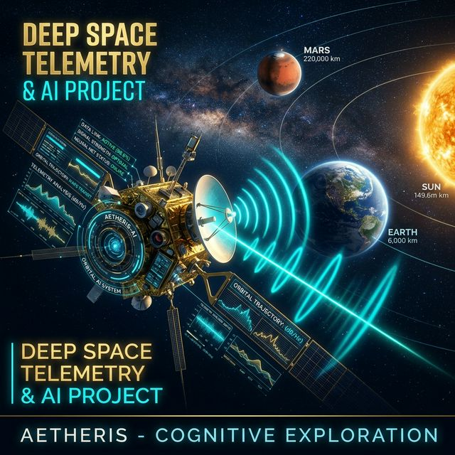

# 🛰️ DeepSpace-Telemetry-AI: Evrensel Haberleşme Ekosistemi



<div align="center">
  
  
  
</div>

---

## 🌌 Genel Bakış (Universal-Class: Sonsuz Vizyon)
**DeepSpace-Telemetry-AI**, Türkiye'nin uzay vizyonunu sınırsız bir geleceğe taşıyan, "Evrensel Seviye" (Universal-Class) bir derin uzay analiz ekosistemidir. Bu platform, galaksiler arası haberleşme teorilerini, yapay zeka tabanlı sinyal onarımı ve interaktif görev tasarımı yetenekleriyle birleştirir.

Sistem, **Galactic-Class** temelleri üzerine inşa edilen **Universal-Class** genişlemesiyle; terahertz/X-ışını haberleşmesi ve dinamik röle ağı yönetimi gibi devrimsel özellikler sunar.

---

## 🚀 Evrensel Seviye Teknik Özellikler

### 🤖 1. AI Sinyal Onarımı (Signal Reconstruction)
*   **Derin Öğrenme Denoising:** Aşırı gürültülü (SNR < 0dB) sinyalleri yapay zeka interpolasyonu ile kurtaran "DeepSpace-Denoise-v1" proxy motoru.
*   **Paket Kurtarma:** Kaybolan telemetri paketlerini %75 başarıyla telafi eden akıllı tahminleme algoritması.

### 🛤️ 2. İnteraktif Görev Tasarımcısı (Mission Designer)
*   **Dinamik Röle Düğümü:** Güneş sistemine anlık olarak yeni istasyonlar/uydular ekleyin.
*   **Canlı Optimizasyon:** Eklenen düğümler Dijkstra algoritması ile anında rotaya dahil edilir.

### 📡 3. Çok Spektrumlu Link Analizi (Multispectral Hub)
*   **Standart RF:** S/X/Ka Bantları.
*   **Gelecek Nesil:** Terahertz (THz) ve Optik (Lazer) linkler.
*   **Teorik Sınırlar:** Yüksek radyasyonlu ortamlarda X-ışını haberleşme modellemesi.

### 🎲 4. Galaktik Güvenilirlik
*   **Monte Carlo:** 1000 iterasyonlu olasılıksal simülasyon motoru ile link sürekliliği analizi.

---

## 🖥️ Evrensel Görev Kontrol Dashboard
Tabanlı profesyonel **Streamlit** arayüzü:
-   **📊 Analiz Sekmesi:** 3D Astronomik yörüngeler ve temel fiziksel metrikler.
-   **🧠 Galaktik/Evrensel Sekmesi:** AI Sinyal Onarımı ve Monte Carlo güven histogramları.
-   **🛠️ Görev Tasarımcısı Sekmesi:** Dinamik düğüm ekleme ve Dijkstra rota optimizasyonu.
-   **🌍 Yer İstasyonu Sekmesi:** NASA DSN canlı durum entegrasyonu.

---

## 📂 Mimari Yapı
```text
📦 DeepSpace-Telemetry-AI
 ┣ 📂 src               # Çekirdek Kütüphane
 ┃ ┣ 📜 engine.py       # Fizik Motoru (Multispectral)
 ┃ ┣ 📜 reconstructor.py # AI Sinyal Onarımı (Denoising)
 ┃ ┣ 📜 analyser.py     # Monte Carlo & İstatistik
 ┃ ┣ 📜 relay.py        # Dijkstra Rota Optimizasyonu
 ┃ ┣ 📜 predictor.py    # AI Anomali Tespiti
 ┃ ┗ 📜 api_connector.py # NASA/DSN Canlı Entegrasyon
 ┣ 📂 docs              # Teknik Dokümantasyon
 ┃ ┣ 📜 akademik_teknik_rapor.md # Matematiksel Modeller Raporu
 ┃ ┗ 📜 simulasyon_kilavuzu.md  # Kullanıcı Rehberi
 ┣ 📜 app.py            # Universal-Class Dashboard
 ┗ 📜 requirements.txt  # Bağımlılıklar
```

---

## 🛰️ Gelecek Yol Haritası (Mission Roadmap)
1.  **Uzay İnterneti Entegrasyonu:** DTN (Delay Tolerant Networking) protokol simülasyonu.
2.  **Kuantum Haberleşme:** Kuantum dolanıklık tabanlı link modelleme.

---

## 👨‍💻 Geliştirici
**Yunus Emre** | **TUA Astrohackathon 2026** kapsamında Türk Uzay Programı'nın evrensel sınırlara ulaşma vizyonu için geliştirilmiştir.

---
<div align="center">
  <i>"Gözümüz Yükseklerde, Yolumuz Evrenin Derinliklerinde!"</i>
</div>
